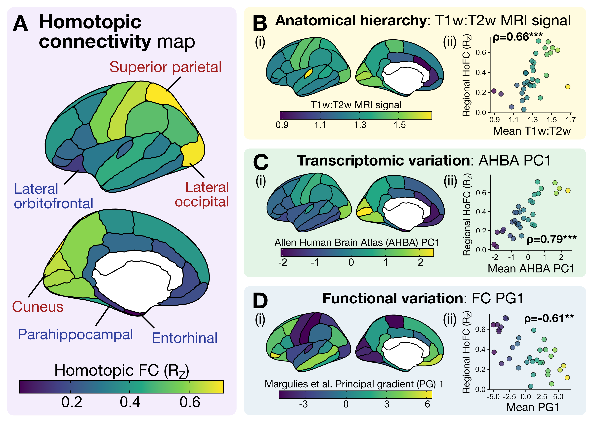
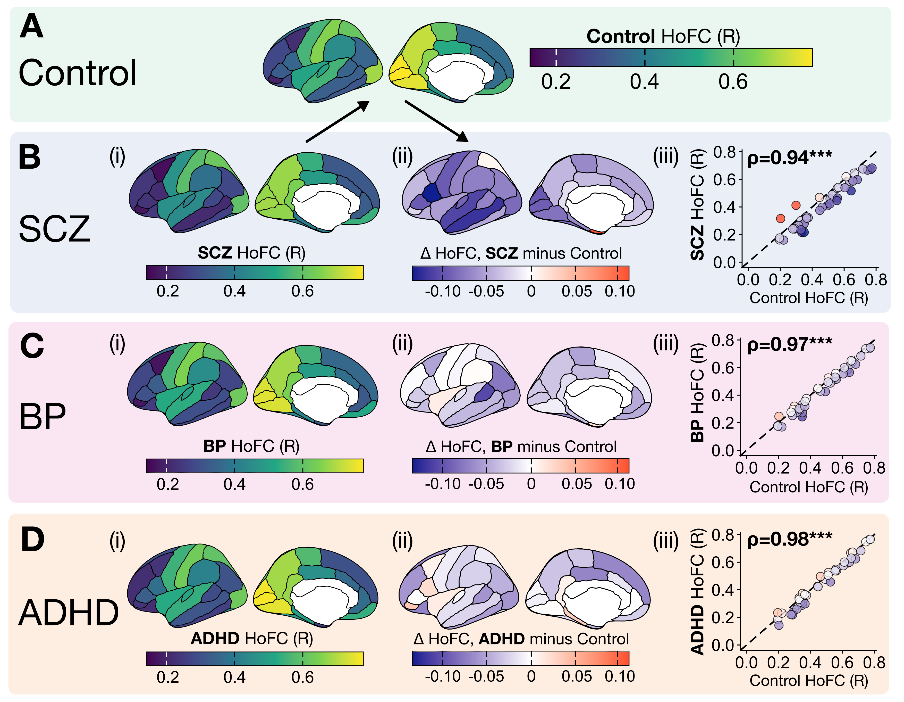

# Homotopic functional connectivity analysis resting-state fMRI

This repository contains all code and intermediate data needed to replicate analyses in our preprint, ['Mapping functional, cytoarchitectonic, and transcriptomic underpinnings of homotopic connectivity']().

## About the data

### Resting-state fMRI data

Two distinct datasets were included in this project, both of which are openly available: (1) the [Human Connectome Project (HCP)](https://pubmed.ncbi.nlm.nih.gov/23684880/) and (2) the [UCLA Consortium for Neuropsychiatric Phenomics LA5c study (CNP)](https://www.nature.com/articles/sdata2016110).
The HCP subset used in this analysis is comprised of $N=207$ unrelated participants ($N=83$ males, $28.7 \pm 3.7$ years of age) from the [S1200 release](https://www.humanconnectome.org/study/hcp-young-adult/document/1200-subjects-data-release), as curated and preprocessed by the [ENIGMA Consortium](https://www.nature.com/articles/s41592-021-01186-4).
Structural and functional connectivity matrices from the HCP dataset were pre-processed and made available by the [ENIGMA Consortium](https://enigma-toolbox.readthedocs.io/en/latest/pages/05.HCP/).

The second dataset in this analysis (UCLA CNP) includes N=252 participants ($N=116$ controls, $N=48$ schizophrenia, $N=49$ bipolar I disorder, and $N=39$ attention-deficit hyperactivity disorder).
Resting-state fMRI data, along with structural MRI, were downloaded from openNeuro and preprocessed in previous work (see [Aquino et al. (2020)](https://doi.org/10.1016/j.neuroimage.2020.116614) and [Bryant et al. (2024)](https://doi.org/10.1371/journal.pcbi.1012692)).
Group-averaged functional connectivity matrices from the UCLA CNP dataset were compiled in [Bryant et al. (2024)](https://doi.org/10.1371/journal.pcbi.1012692) and are included here in the [data/](https://github.com/DynamicsAndNeuralSystems/Homotopic_FC_HCP/tree/main/data/) folder for reproducibility.

### Brain maps of topographical hierarchy

We examined three indices of topographical hierarchy from the neuromaps library: structural, functional, and transcriptomic.
All map information is provided in the [`neuromaps` documentation](https://netneurolab.github.io/neuromaps/listofmaps.html). 
* Structural: `hcps1200-myelinmap-fsLR-32k` 
* Functional: `margulies2016-fcgradient01-fsLR-32k`
* Transcriptomic: `abagen-genepc1-fsaverage-10k`

Parcellated data (in the 68-region Desikan-Killiany atlas) are included in the [data/](https://github.com/DynamicsAndNeuralSystems/Homotopic_FC_HCP/tree/main/data/) directory for reproducibility.

### Brain maps of geometric embedding

We examined two aspects of geometric embedding in the cortex: structural connectivity and Euclidean distance between homotopic region-region pairs.
For structural connectivity, we used the group-averaged structural connectome from the same $N=207$ HCP participants as the fMRI dataset included in the [ENIGMA Toolbox](https://enigma-toolbox.readthedocs.io/en/latest/pages/05.HCP/).

To compute the physical distance between each homotopic region--region pair, we calculated the Euclidean distance between centroid vertices (on the pial surface) per region in the [`fsaverage` template space](https://surfer.nmr.mgh.harvard.edu/fswiki/FsAverage) from FreeSurfer.

Parcellated data (in the 68-region Desikan-Killiany atlas) are included in the [data/](https://github.com/DynamicsAndNeuralSystems/Homotopic_FC_HCP/tree/main/data/) directory for reproducibility.

### Brain maps of vascular innervation

We examined two aspects of vascular innervation in the cortex: arterial density and venous density.
For both properties, we queried brain maps published in [Bernier et al. (2018)](https://doi.org/10.1002/hbm.24337), where the details of imaging acquisition and preprocessing can be found.
Voxelwise arterial and venous density maps were downloaded from the [Braincharter vasculature repository](https://github.com/braincharter/vasculature/releases/tag/Atlas_v1.0).
Parcellated data (in the 68-region Desikan-Killiany atlas) are included in the [data/](https://github.com/DynamicsAndNeuralSystems/Homotopic_FC_HCP/tree/main/data/) directory for reproducibility.

### Transcriptomic data

To characterize key molecular correlates of regional HoFC variation, we examined the expression of two layer 5 pyramidal neuron markers: *CTIP2* (a.k.a. *BCL11B*) and *SATB2*.
We queried these two genes from postmortem microarray data (averaged across all donors) provided by the [Allen Human Brain Atlas (AHBA)](https://human.brain-map.org/) using the [`abagen` python package](https://github.com/rmarkello/abagen) (version 0.1.3).

Parcellated data (in the 68-region Desikan-Killiany atlas) are included in the [data/](https://github.com/DynamicsAndNeuralSystems/Homotopic_FC_HCP/tree/main/data/) directory for reproducibility.

## Replicating our analyses and figures

All analyses and visualizations are fully reproducible using a series of five Jupyter notebooks contained in the [data_visualization/](https://github.com/DynamicsAndNeuralSystems/Homotopic_FC_HCP/tree/main/data_visualization/) folder.

### Figure 1: Regional homotopic connectivity variation aligns with macroscale gradients of the topographical hierarchy

Components of this figure can be recreated with the notebook [1_Pearson_HoFC_vs_hierarchy.ipynb](https://github.com/DynamicsAndNeuralSystems/Homotopic_FC_HCP/blob/main/data_visualization/1_Pearson_HoFC_vs_hierarchy.ipynb).

### Figure 2: The macroscale HoFC regional gradient is preserved across neuropsychiatric disorders, despite global decreases in inter-hemispheric coupling

Components of this figure can be recreated with the notebook [2_Pearson_HoFC_neuropsychiatric.ipynb](https://github.com/DynamicsAndNeuralSystems/Homotopic_FC_HCP/blob/main/data_visualization/2_Pearson_HoFC_neuropsychiatric.ipynb).

### Figure 3: Homotopic connectivity is linked to macroscale functional network topology within and across hemispheres

Components of this figure can be recreated with the notebook [3_Pearson_HoFC_vs_network_topology.ipynb](https://github.com/DynamicsAndNeuralSystems/Homotopic_FC_HCP/blob/main/data_visualization/3_Pearson_HoFC_vs_network_topology.ipynb).

### Figure 4: Regional HoFC is not statistically associated with structural connectivity or Euclidean distance, but it is inversely associated with arterial density

Components of this figure can be recreated with the notebook [4_Pearson_HoFC_vs_structural_vascular.ipynb](https://github.com/DynamicsAndNeuralSystems/Homotopic_FC_HCP/blob/main/data_visualization/4_Pearson_HoFC_vs_structural_vascular.ipynb).

### Figure 5: Homotopic connectivity magnitude is positively associated with expression of *SATB2*, a marker of intra-telencephalic layer 5 pyramidal neurons, and with resting-state thalamic connectivity

Components of this figure can be recreated with the notebook [5_Pearson_HoFC_vs_L5PN_and_thal.ipynb](https://github.com/DynamicsAndNeuralSystems/Homotopic_FC_HCP/blob/main/data_visualization/5_Pearson_HoFC_vs_L5PN_and_thal.ipynb).